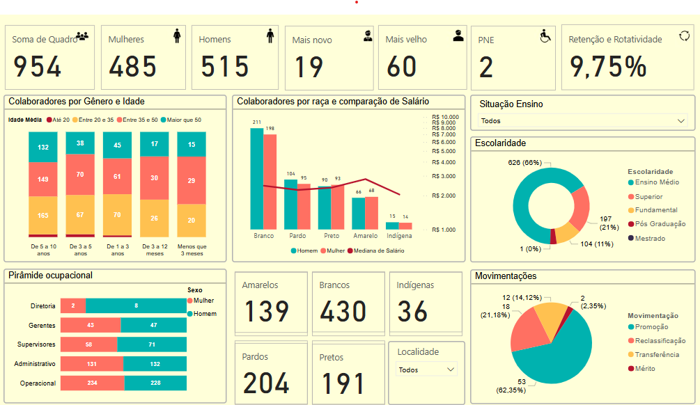

# People Analytics Portfolio

This repository showcases projects developed in People Analytics, focused on data-driven Human Resources strategies such as diversity, inclusion, and workforce equity.

All datasets are simulated and do not reflect real company data.

## 🔍 Projects Included

- **Diversity & Inclusion Report**: A Power BI dashboard built using simulated HR data to analyze workforce composition by gender, race, disability (PCD), and education. The project explores representation across job levels and highlights potential equity gaps in leadership and operational areas.

## 📊 Diversity Dashboard Preview

  

## 🛠️ Tools Used

- Power BI  
- Excel  
- Python (for data simulation)  
- HR Data Modeling

## 👤 About Me

Pedro Scriboni Dubovicki — HR Analyst with expertise in People Analytics, data storytelling, and workforce planning.

Feel free to connect with me on [LinkedIn](https://www.linkedin.com/in/dubovicki/)
